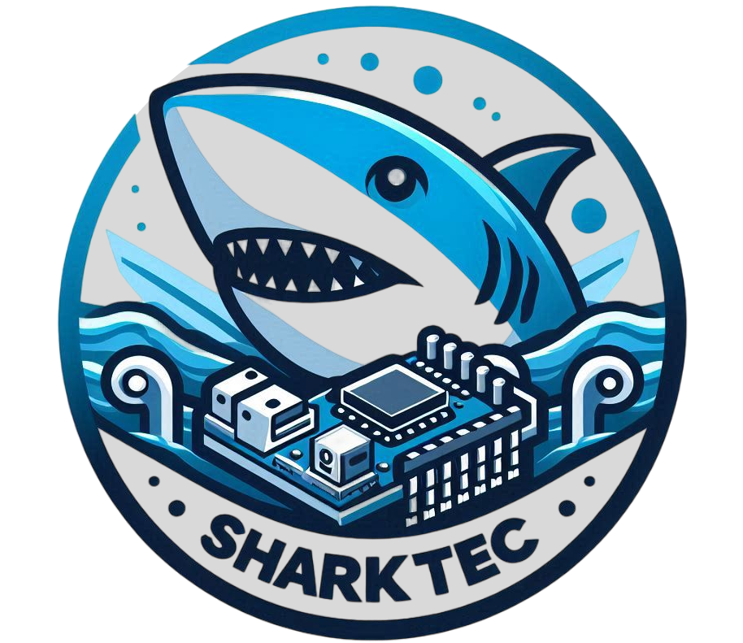

<h2>Olá, Este é o projeto do grupo @SharkTec</h2>

### Integrantes:
- Giovanna Ferreira Cavalcanti [Link do github](https://github.com/Giovanna-Cavalcanti)
- Kauã Fernandes Souza de Melo [Link do github](https://github.com/K1Melo)
- Mateus Lima Rodrigues da silva [Link do github](https://github.com/mateuslima0)
- Udiel Inácio de Oliveira Silva [Link do github](https://github.com/Udiel-Oliveira)

<<<<<<< HEAD

=======

>>>>>>> a995bc4e3b3e9ebf4176a99b89a8c24e8392010b

 
  O grupo <strong>@SharkTec</strong> é composto por alunos da ETEC de Carapicuíba, o trabalho que estamos desenvolvendo é mentorado pelo professor Wesley Castanha de Lima, e será voltado para ser apresentado no pitch e prototipação inicial do 7° Hackaton acadêmico do Robótica Paula Souza.  
 🦑 O tema deste hackaton é "Desenvolvimento Humano para uma Escola Plural e Democrática".

  🦈 Nós da SharkTec montamos uma <strong>landing page</strong> com os valores do projeto principal

### Confira o Site: 

  🪸 **Nosso grupo pensou e projetou um aplicativo móvel que se encaixaria perfeitamente no tema, sendo nossa principal motivação, a melhoria da vivência de estudo**

### Confira o protótipo: 

